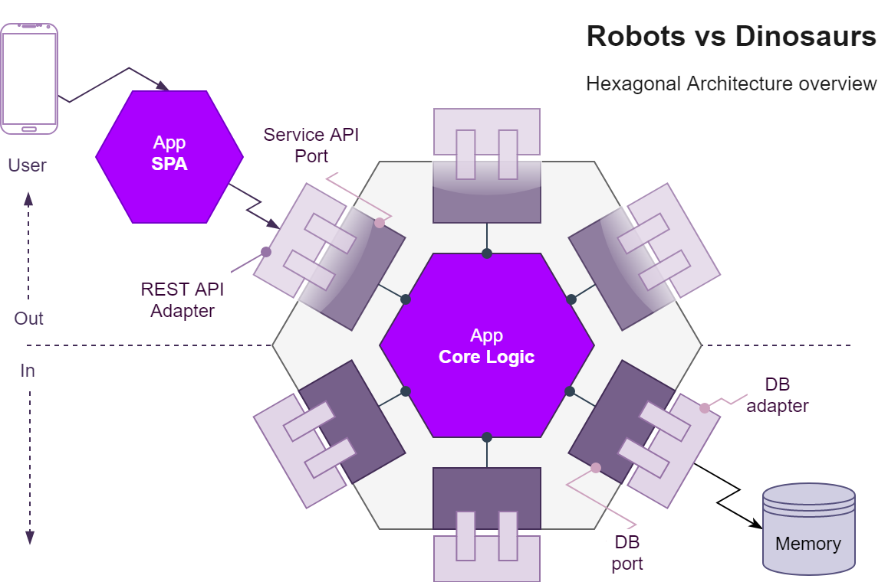

# Welcome to Robots vs Dinosaurs!

Clojure/ClojureScript applications to support simulations on an army of remote-controlled robots that fight dinosaurs!

## Contents
- [Overview](#overview)
	- [Architecture](#architecture)
		- [Ports](#ports)
		- [Adapters](#adapters)
		- [Controllers](#controllers)
		- [Logic](#logic)
- [Development](#development)
- [Deploy](#deploy)
- [Curl](#curl)

<a name="overview"></a>
## Overview 

The **Robots vs Dinosaurs** project is separated into two apps: the **Clojure** server-side app and the extra **ClojureScript** client-side app.

<a name="architecture"></a>
### Architecture 

The **API** is written in Clojure based on the **Alistair Cockburn's Hexagonal Architecture** with the **Stuart Sierra's Component Model** for managing the life-cycle of components which have run-time state, which can be seen as the dependency injection for immutable data structures.



<a name="ports"></a>
#### Ports 
Each **port** has a corresponding **Component** on the **System Map**:

- **Storage**
	- Which is a protocol to access a single **atom** to share and persist data (also considered to use `refs` to make use of the `STM`, e.g. for a transaction which generates the `ID` and saves an entity)
	
- **Routes**
	- To get the service routes mapping.

- **Service**
	-  With **Pedestal** as the service provider.

- **Router** 
	- With **Reitit** as the alternative routing engine, which is faster than the Pedestal's default.

	- **Interceptors** 
		- Custom redirect for trailing slashes `/`.
		- Clojure's **spec alpha** request/response coercion.
		- **Swagger** support, in `dev` mode.
		- Error logging using **Logback** with custom response.
	
- **Server**
	- With **Jetty** as the default http server which listens to `PORT` environment variable (useful for Heroku) or `8080` as the default port binding.

<a name="adapters"></a>
#### Adapters 
Used to wire the external spec to the internal spec.

<a name="controllers"></a>
#### Controllers 
The bridge between **ports**, **adapters** and **logic** layers.

<a name="logic"></a>
#### Logic 
The logic is the largest part of the application and is made of the below business entities with Clojure's **Spec** to domain modelling coercion: 

- **Simulation**
	- Has `id` `title` `scoreboard` and `board`.

- **Scoreboard**
	- Has `total`
	
- **Board**
	- Has `size` and `units`.

- **Unit**
	
	- **Robot**
		- Has `id` `point` `direction`.
				
	- **Dinosaur**
		- Has `id` `point`.
	
- **Size**
	- Has `width` and `height`.
	
- **Point**
	- Has `x` and `y`

- **Direction**
	- Has `orientation` and `point`

**Notes:** How to deal with state is a good topic of thinking, the decision to use Records over maps is because of its performance (as read in **Joy of Clojure**), but other state maintaining methods could also be used, e.g. [Managing State in Clojure](https://github.com/oubiwann/maintaining-state-in-clojure).

<a name="development"></a>
### Development
The development workflow is based on the **Stuart Sierra's** [Clojure Reloaded Workflow](http://thinkrelevance.com/blog/2013/06/04/clojure-workflow-reloaded) to build the system while simultaneously interacting with it using **REPL**.

#### REPL
Start **REPL** with the `dev` profile:

```posh
lein repl +dev
```

Reload the **System**:

```clj
user=> (user/reset)
```

#### Aliases
Run with `dev` profile:

```clj
lein run-dev
``` 

<a name="deploy"></a>
### Deploy 

#### Uberjar

Compile the `uberjar`:

```posh
lein uberjar
```

Run with optional `port`:

```posh
java -Dport=4000 -jar target\uberjar\robots-vs-dinosaurs-standalone.jar
```

#### Docker

To build and run the **Docker** container with the **Dockerfile** with the **uberjar** execute:

```posh
docker build -t <image_tag> . && docker run --env PORT=4000 --name robots-vs-dinosaurs <image_tag>
```

#### Heroku

The project has a `Procfile` file for Heroku deployment which can be executed with **Heroku Git** or **Heroku GitHub** integration which supports automatic deployment on a branch of choice.

### Curl e.g. <a name="curl"></a>

#### Simulations

```posh
curl -X GET localhost:4000/api/simulations
```
```jsonc
[
    {
        "id": 0,
        "title": "Aerodynamic chinchilla",
        "board": {
            // ...
        },
        "scoreboard": {
            "total": 0
        }
    },
    {
        "id": 16,
        "board": {
            // ...
        },
        "title": "Heavy voracious bunny buffalo",
        "scoreboard": {
            "total": 20
        }
    }, // ...
]
```

```posh
curl -X GET localhost:4000/api/simulations/16
```
```jsonc
{
    "id": 16,
    "title": "Heavy voracious bunny buffalo",
    "scoreboard": {
        "total": 20
    },
    "board": {
        "size": {
            "width": 6,
            "height": 6
        },
        "units": [
            //...
        ]
    }
}
```

```posh
curl -X POST --header 'Content-Type: application/json' -d 
'{ \  
    "title": "Aerodynamic Chinchilla", \ 
    "size": { \ 
      "width": 15, \ 
      "height": 15 \ 
    } \
 }' localhost:4000/api/simulations
 ```
 
```posh
curl -X DELETE localhost:4000/api/simulations/16
```
```
{
  "success": true
}
```

```posh
curl -X GET localhost:4000/api/simulations/16/as-game
```
```
R|_|_|_|_|_
_|_|_|_|_|_
_|_|_|_|_|_
_|_|_|_|_|_
_|_|_|D|_|_
_|D|R|D|_|_
```

#### Robots

```posh
curl -X GET localhost:4000/api/simulations/16/robots
```

```posh
curl -X POST --header 'Content-Type: application/json' -d 
'{ \ 
   "point": { \ 
     "x": 5, \ 
     "y": 5 \ 
   }, \ 
   "orientation": "right" \ 
 }' localhost:4000/api/simulations/16/robots
```

```posh
curl -X GET localhost:4000/api/simulations/16/robots/17
```

```posh
curl -X GET localhost:4000/api/simulations/16/robots/17/turn-left
```

```posh
curl -X GET localhost:4000/api/simulations/16/robots/17/turn-right
```

```posh
curl -X GET localhost:4000/api/simulations/16/robots/17/move-forward
```

```posh
curl -X GET localhost:4000/api/simulations/16/robots/17/move-backward
```

```posh
curl -X GET localhost:4000/api/simulations/16/robots/17/attack
```
```json
[
    {
        "id": 18,
        "type": "dinosaur",
        "point": {
            "y": 5,
            "x": 3
        }
    },
    {
        "id": 19,
        "type": "dinosaur",
        "point": {
            "y": 5,
            "x": 1
        }
    }
]
```


#### Dinosaurs

```posh
curl -X GET localhost:4000/api/simulations/16/dinosaurs
```

```posh
curl -X POST --header 'Content-Type: application/json' -d 
'{ \ 
   "point": { \ 
     "x": 4, \ 
     "y": 4 \ 
   } \ 
 }' localhost:4000/api/simulations/16/dinosaurs
```

```posh
curl -X GET localhost:4000/api/simulations/16/dinosaurs/20
```

## License

Copyright © 2019

This program and the accompanying materials are made available under the
terms of the Eclipse Public License 2.0 which is available at
http://www.eclipse.org/legal/epl-2.0.

This Source Code may also be made available under the following Secondary
Licenses when the conditions for such availability set forth in the Eclipse
Public License, v. 2.0 are satisfied: GNU General Public License as published by
the Free Software Foundation, either version 2 of the License, or (at your
option) any later version, with the GNU Classpath Exception which is available
at https://www.gnu.org/software/classpath/license.html.
