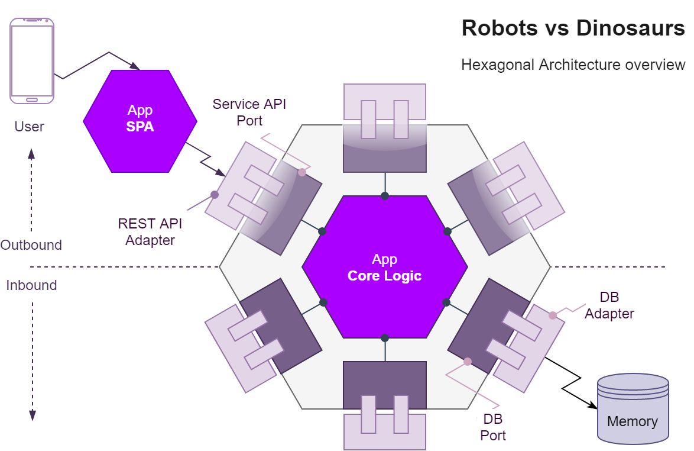

# Robots vs Dinosaurs

Clojure/ClojureScript apps to support simulations on an army of remote-controlled robots that fight dinosaurs!

## Contents
- [Overview](#overview)
	- [Architecture](#architecture)
		- [Ports](#ports)
		- [Adapters](#adapters)
		- [Controllers](#controllers)
		- [Logic](#logic)
- [Development](#development)
- [Deploy](#deploy)
- [Examples](#examples)

<a name="overview"></a>
## Overview 

The **Robots vs Dinosaurs** project is separated into two apps: the **Clojure** server-side app and the extra **ClojureScript** client-side app.

<a name="architecture"></a>
### Architecture 

The **API** is written in Clojure based on the **Alistair Cockburn's Hexagonal Architecture** with the **Stuart Sierra's Component Model** for managing the life-cycle of components which have run-time state, can be seen as the dependency injection for immutable data structures.



<a name="ports"></a>
#### Ports 
Each **port** has a corresponding **Component** on the **System Map**:

- **Storage**
	- Which is a protocol to access a single **atom** to share and persist data (also considered to use `refs` to make use of the `STM`, e.g. for a transaction which generates the `ID` and saves an entity)
	
- **Routes**
	- To get the service routes mapping.

- **Service**
	-  With **Pedestal** as the service provider.

- **Router** 
	- With **Reitit** as the alternative routing engine, which is faster than the Pedestal's default.

	- **Interceptors** 
		- Custom redirect for trailing slashes `/`.
		- Clojure's **spec alpha** request/response coercion.
		- **Swagger** support, in `dev` mode.
		- Error logging using **Logback** with custom response.
	
- **Server**
	- With **Jetty** as the default http server which listens to `PORT` environment variable (useful for Heroku) or `8080` as the default port binding.

<a name="adapters"></a>
#### Adapters 
Used to wire the external spec to the internal spec.

<a name="controllers"></a>
#### Controllers 
The bridge between **ports**, **adapters** and **logic** layers.

<a name="logic"></a>
#### Logic 
The logic is the largest part of the application and is made of the below business entities with Clojure's **Spec** to domain modelling coercion: 

- **Simulation** has `id` `title` `scoreboard` and `board`.

- **Scoreboard** has `total`
	
- **Board** has `size` and `units`.

- **Unit**
	
	- **Robot** has `id` `point` and `direction`.
				
	- **Dinosaur** has `id` and `point`.
	
- **Size** has `width` and `height`.
	
- **Point** has `x` and `y`

- **Direction** has `orientation` and `point`

**Notes:** How to deal with state is a good topic of discussion, the decision to use Records over maps is because of its performance (as read in **Joy of Clojure**), but other state maintaining methods could also be used, e.g. [Managing State in Clojure](https://github.com/oubiwann/maintaining-state-in-clojure).

<a name="development"></a>
### Development
The development workflow is based on the **Stuart Sierra's** [Clojure Reloaded Workflow](http://thinkrelevance.com/blog/2013/06/04/clojure-workflow-reloaded) to build the system while simultaneously interacting with it using **REPL**.

#### REPL
Start **REPL** with the `dev` profile:

```posh
lein repl +dev
```

Reload the **System**:

```clj
user=> (user/reset)
```

#### Aliases
Run with `dev` profile:

```clj
lein run-dev
``` 

<a name="deploy"></a>
### Deploy 

#### Uberjar

Compile the `uberjar`:

```posh
lein uberjar
```

Run with optional `port`:

```posh
java -Dport=4000 -jar target\uberjar\robots-vs-dinosaurs-standalone.jar
```

#### Docker

To build and run the **Docker** container with the **Dockerfile** with the **uberjar** execute:

```posh
docker build -t <image_tag> . && docker run --env PORT=4000 --name robots-vs-dinosaurs <image_tag>
```

#### Heroku

The project has a `Procfile` file for Heroku deployment which can be executed with **Heroku Git** or **Heroku GitHub** integration which supports automatic deployment on a branch of choice.

### Examples <a name="examples"></a>

`curl -X GET localhost:4000/api/simulations`

`200 Content-Type: application/json`


`curl -X DELETE localhost:4000/api/simulations/16`

`200 Content-Type: application/json`


Gets a simulation space as a simple `text/plain` game.

`curl -X GET localhost:4000/api/simulations/16/as-game`

`200 Content-Type: text/plain`


Create a robot in a certain position and facing direction.

`curl -X POST --header 'Content-Type: application/json' -d 
'{ \ 
   "point": { \ 
     "x": 5, \ 
     "y": 5 \ 
   }, \ 
   "orientation": "right" \ 
 }' localhost:4000/api/simulations/16/robots
`

`201 Content-Type: application/json`


Makes a robot attack around it: in front, to the left, to the right and behind.

`curl -X GET localhost:4000/api/simulations/16/robots/17/attack`

`200 Content-Type: application/json`


## License

Copyright © 2019
